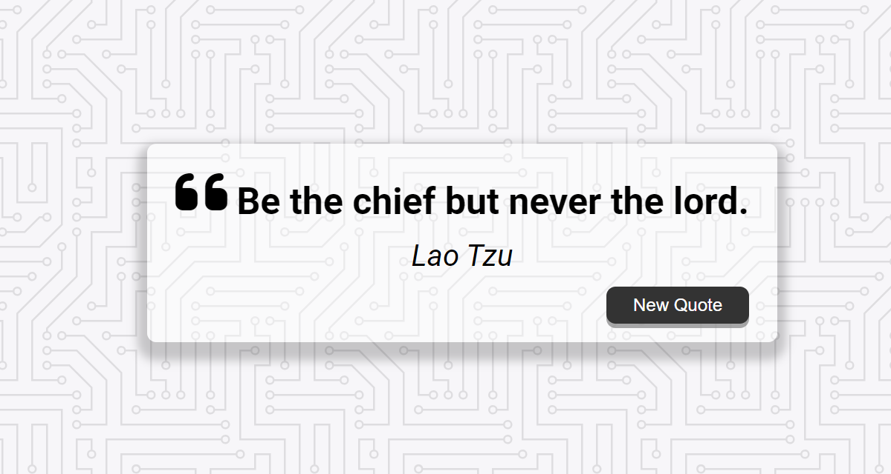

# Random Quote Generator

This project is a simple web-based random quote generator built using HTML, CSS, and JavaScript. It displays a new quote each time the user clicks a button, enhancing user engagement and interaction with inspirational or thought-provoking quotes.

## Features

- **Random Quotes**: Generates a new quote randomly from a predefined list.
- **Dynamic Display**: Updates the quote and author dynamically without reloading the page.
- **User Interaction**: Allows the user to click a button to fetch and display a new quote instantly.

## Technologies Used

- **HTML**: Provides the structure and content of the web page.
- **CSS**: Styles the layout and enhances the visual presentation.
- **JavaScript**: Implements the logic to fetch and display random quotes.

## How to Use

1. Clone the repository or download the ZIP file.
2. Open `index.html` in your web browser.
3. Click the "New Quote" button to display a new random quote.

## Screenshots

